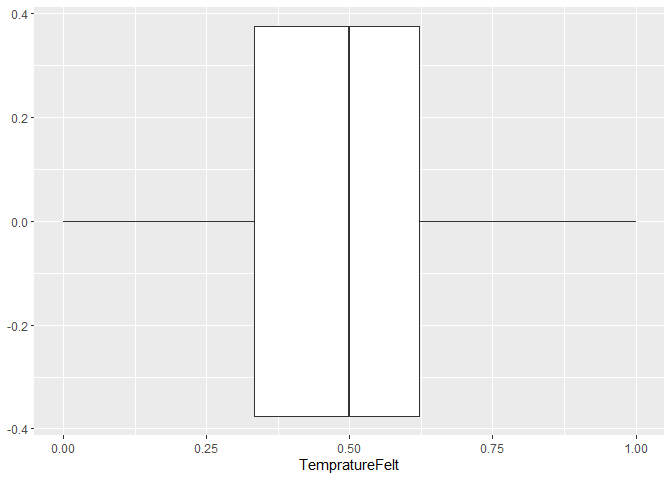

Forecast Bike Rental
================
Abhishek Kishore
13/06/2020

### Objective

The objective of this study is to help the bike company plan for any
additional number of bikes that might be needed in case of high demand
in the next three months. Or, if the demand is low the predction might
be required to plan the removal of bikes needing maintenance from
circulation, without impacting the ridership.

Also, it migh also be important to see how many casual riders are using
the bikes against the registered members to plan for the membership
drive.

    ## Warning: package 'DataExplorer' was built under R version 3.5.3

    ## Warning: package 'scales' was built under R version 3.5.3

    ## Warning: package 'ggplot2' was built under R version 3.5.3

    ## Warning: package 'M3' was built under R version 3.5.3

    ## Loading required package: ncdf4

    ## Warning: package 'ncdf4' was built under R version 3.5.3

    ## Loading required package: rgdal

    ## Warning: package 'rgdal' was built under R version 3.5.3

    ## Loading required package: sp

    ## Warning: package 'sp' was built under R version 3.5.3

    ## rgdal: version: 1.4-8, (SVN revision 845)
    ##  Geospatial Data Abstraction Library extensions to R successfully loaded
    ##  Loaded GDAL runtime: GDAL 2.2.3, released 2017/11/20
    ##  Path to GDAL shared files: C:/Users/akishore/Documents/R/win-library/3.5/rgdal/gdal
    ##  GDAL binary built with GEOS: TRUE 
    ##  Loaded PROJ.4 runtime: Rel. 4.9.3, 15 August 2016, [PJ_VERSION: 493]
    ##  Path to PROJ.4 shared files: C:/Users/akishore/Documents/R/win-library/3.5/rgdal/proj
    ##  Linking to sp version: 1.3-2

    ## Loading required package: maps

    ## Warning: package 'maps' was built under R version 3.5.3

    ## Loading required package: mapdata

    ## Warning: package 'mapdata' was built under R version 3.5.3

    ## Warning: package 'corrplot' was built under R version 3.5.3

    ## corrplot 0.84 loaded

    ## Warning: package 'car' was built under R version 3.5.3

    ## Loading required package: carData

    ## Warning: package 'carData' was built under R version 3.5.3

\#\#\#Exploratory Data Analysis

    ## 'data.frame':    15211 obs. of  17 variables:
    ##  $ instant   : int  1 2 3 4 5 6 7 8 9 10 ...
    ##  $ dteday    : chr  "01-01-2011" "01-01-2011" "01-01-2011" "01-01-2011" ...
    ##  $ season    : int  1 1 1 1 1 1 1 1 1 1 ...
    ##  $ yr        : int  0 0 0 0 0 0 0 0 0 0 ...
    ##  $ mnth      : int  1 1 1 1 1 1 1 1 1 1 ...
    ##  $ hr        : int  0 1 2 3 4 5 6 7 8 9 ...
    ##  $ holiday   : int  0 0 0 0 0 0 0 0 0 0 ...
    ##  $ weekday   : int  6 6 6 6 6 6 6 6 6 6 ...
    ##  $ workingday: int  0 0 0 0 0 0 0 0 0 0 ...
    ##  $ weathersit: int  1 1 1 1 1 2 1 1 1 1 ...
    ##  $ temp      : num  0.24 0.22 0.22 0.24 0.24 0.24 0.22 0.2 0.24 0.32 ...
    ##  $ atemp     : num  0.288 0.273 0.273 0.288 0.288 ...
    ##  $ hum       : num  0.81 0.8 0.8 0.75 0.75 0.75 0.8 0.86 0.75 0.76 ...
    ##  $ windspeed : num  0 0 0 0 0 0.0896 0 0 0 0 ...
    ##  $ casual    : int  3 8 5 3 0 0 2 1 1 8 ...
    ##  $ registered: int  13 32 27 10 1 1 0 2 7 6 ...
    ##  $ cnt       : int  16 40 32 13 1 1 2 3 8 14 ...

  - **Observations**
      - The training dataset has a total of 15211 records with 16
        features.
      - Feature “instant” indicates that record instance and is not
        required for analysis.
      - Feature “dteday”" can be combined with “hr”" to have a combined
        data and time field.
      - “dteday” indicates the date on which the observation was made.
      - “season” indicates the season during which the observation was
        made.
      - “yr” indicates the year of observation
      - “mnth” indicates the month in which the observation was made.
      - “hr” indicate the hour of day during which the observatio was
        made.
      - “holiday” indicates if the observation was made on a holiday or
        not.
      - “weekday” indicates the day of the week on which the observation
        was made.
      - “workingday” indicates if the observatio was made on a working
        day or during a holiday/weekend.
      - “weathersit” indicates the weather at the time of observation.
      - “temp” indicates the degree celcius temaprature at the time of
        observation.
      - “atem” indicates the degree celcius temaprature actually fealt
        at the time of observation.
      - “hum” indicates the humiditymeasure at the time of observation.
      - “windspeed” indicates the speed of wind at the time of
        observation.
      - “casual” indicates the number of non-member riders that took
        rides at the time of observation.
      - “registered” indicates the number of members that tool rides at
        the time of observation.
      - “cnt” indicates the total number of riders that took rides at
        the time of observation.

\#\#Feature Renaming

``` r
# Removing instant feature
train_dataset = train_dataset[,-1]

names(train_dataset)[1] = "DateDay"
names(train_dataset)[2] = "Season"
names(train_dataset)[3] = "Year"
names(train_dataset)[4] = "Month"
names(train_dataset)[5] = "Hour"
names(train_dataset)[6] = "Holiday"
names(train_dataset)[7] = "Weekday"
names(train_dataset)[8] = "WorkingDay"
names(train_dataset)[9] = "Weather"
names(train_dataset)[10] = "Temprature"
names(train_dataset)[11] = "TempratureFelt"
names(train_dataset)[12] = "Humidity"
names(train_dataset)[13] = "WindSpeed"
names(train_dataset)[14] = "CasualRiders"
names(train_dataset)[15] = "RegisteredRiders"
names(train_dataset)[16] = "TotalRiders"
```

\#\#Check Missing Data

<!-- -->

  - **Observations**
      - No missing data found in test dataset.

\#\#Check Multi-Collinearity

<!-- -->

  - **Observations**
      - Strong relation can be seen between Season and Month
      - Strong relation can be seen between Temprature and
        TempratureFealt.
      - Strong relation can be seen between CasualRiders and
        TotalRiders.
      - Strong relation can be seen between RegisteredRiders and
        TotalRiders.
      - Moderate relation can be seen between Season and Temprature &
        TempratureFelt.
      - Moderate relation can be seen between Weather and Humidity.

## Univariate Analysis

    ##     DateDay              Season       Year          Month           Hour      
    ##  Min.   :2011-01-01   Spring:3980   2011:8645   May    :1488   Min.   : 0.00  
    ##  1st Qu.:2011-06-12   Summer:4409   2012:6566   Jul    :1488   1st Qu.: 6.00  
    ##  Median :2011-11-18   Fall  :4496               Aug    :1475   Median :12.00  
    ##  Mean   :2011-11-17   Winter:2326               Mar    :1473   Mean   :11.55  
    ##  3rd Qu.:2012-04-25                             Jun    :1440   3rd Qu.:18.00  
    ##  Max.   :2012-09-30                             Apr    :1437   Max.   :23.00  
    ##                                                 (Other):6410                  
    ##  Holiday          Weekday               WorkingDay            Weather     
    ##  No :14806   Sunday   :2190   Workday        :10416   Clear       :10189  
    ##  Yes:  405   Monday   :2167   Holiday/Weekend: 4795   Cloudy      : 3760  
    ##              Tuesday  :2155                           LightShowers: 1259  
    ##              Wednesday:2163                           Bad         :    3  
    ##              Thursday :2161                                               
    ##              Friday   :2175                                               
    ##              Saturday :2200                                               
    ##    Temprature     TempratureFelt      Humidity        WindSpeed     
    ##  Min.   :0.0200   Min.   :0.0000   Min.   :0.0000   Min.   :0.0000  
    ##  1st Qu.:0.3400   1st Qu.:0.3333   1st Qu.:0.4700   1st Qu.:0.1045  
    ##  Median :0.5400   Median :0.5000   Median :0.6200   Median :0.1940  
    ##  Mean   :0.5127   Mean   :0.4892   Mean   :0.6249   Mean   :0.1915  
    ##  3rd Qu.:0.6600   3rd Qu.:0.6212   3rd Qu.:0.7800   3rd Qu.:0.2537  
    ##  Max.   :1.0000   Max.   :1.0000   Max.   :1.0000   Max.   :0.8507  
    ##                                                                     
    ##   CasualRiders    RegisteredRiders  TotalRiders   
    ##  Min.   :  0.00   Min.   :  0      Min.   :  1.0  
    ##  1st Qu.:  4.00   1st Qu.: 33      1st Qu.: 39.0  
    ##  Median : 17.00   Median :112      Median :138.0  
    ##  Mean   : 36.24   Mean   :149      Mean   :185.2  
    ##  3rd Qu.: 50.00   3rd Qu.:213      3rd Qu.:275.0  
    ##  Max.   :367.00   Max.   :886      Max.   :977.0  
    ## 

  - **Observations**
      - Higest number of observations were made in Fall season, followed
        by Summer, Spring and then Winter indicting imbalance on number
        of observations made and possible gaps between the obsevations.
      - Data spread between features “Holiday”, “Weekday” and “Working
        Day” are representing similar data points.

<!-- -->
<!-- -->

  - **Observations**
      - No temprature outliers noticed indicating absence of extrem
        tempratures.
      - However, more higher tempratures noticed during the observation
        period.

<!-- -->
<!-- -->

  - **Observations**
      - No extreme tempratures felt.
      - Temprature felt was slightly on the higher side as noticed
        against actual temprature.

<!-- -->
<!-- -->

  - **Observations**
      - Zero humidity noticed as an outlier. But can not be ignore as it
        is possible to have zero humidity.

<!-- -->
<!-- -->

  - **Observations**
      - Multiple outliers on wind speed can be noticed. But can not be
        ignored as its possiblity to have high windspeeds.

## Bi-variate Analysis

<!-- -->

  - **Observations**
      - Fall season has the highest number of ridership.
      - Ridership falls in winter and picks up again in Spring and
        Summer.

<!-- -->

  - **Observations**
      - The indicated observation coinsides with the observation made
        for seasons.
      - During the last three months of the year, the ridership falls
        drastically.
      - Starting Jaunary the riderships continues picks up again month
        on month untill winter.

<!-- -->

  - **Observations**
      - Ridership remains low during the non woring hours.
      - Ridership seems to high during the start of the office hours
        around 7 to 9 AM, with peak at 9 AM.
      - More number of people seems to be using the bike in the evening
        than in the morning.
      - Intrestingly, the bike usage starts to pick up starting mid-day.

<!-- -->

  - **Observations**
      - Bike usage is more during working days (excluding weekends).

<!-- -->

  - **Observations**
      - Ridership seems to be almost same across all weekdays.

<!-- -->

  - **Observations**
      - Ridership is more during the workdays against holidays.
      - On holiday or weekend, the usage falls.

<!-- -->

  - **Observations**
      - Bike usage is higest while the weather is clear.
      - Ridership drops drastically while the weathre is Cloudy/Misty or
        Showers and almost zero during bad weather.

<!-- -->

  - **Observations**
      - As temprature rises, the bike usage seems to go up. However,
        beyond 0.75 celcius the usage falls.
      - Lesser the temprature, lesser the usage.

<!-- -->

  - **Observations**
      - As people feel more temprature, the bike usage seems to go up.
        However, beyond 0.60 celcius the usage falls.
      - Lesser the temprature felt, lesser the usage.

<!-- -->

  - **Observations**
      - No clear pattern can be found bwtween humidity and bike usage.

<!-- -->

  - **Observations**
      - Bike usage is higest while wind is not blowing.
      - Usage contines to drops as windspeed picks up beyond 0.20.

### Project Notes II

  - **Observations from Project Notes I:**
      - No missing values were noticed.
      - Outliers need no treatment as indicated data points are possible
        in normal run.
      - Higest number of observations were made in Fall season, followed
        by Summer, Spring and then Winter indicating imbalance on number
        of observations made and possible gaps between the obsevations.
        However, the difference is not huge.
      - Bike usage seems to be almost same across all days of the week,
        wheather its a working day or holiday/weekend.
      - Fall season has the highest number of ridership followed by
        summer, spring and winter.
      - During the last three months of the year (Start of winter), the
        ridership falls drastically.
      - Starting January the riderships continues to picks up again
        month on month untill winter.
      - In mornings, the registered ridership starts to pick up from 6
        AM with peaks at 8 AM. From 9 AM onwards the usage reamains
        almost same and picks up again starting 4 PM.
      - In evening, the registered ridership picks up from 4 PM and
        reaches peak at 5 PM and then gradually reduces.
      - Between 00 AM and 5 AM, the registered ridership is at minumum.
      - The casual ridership starts to pick up at 6 AM and gradually
        increaes untill it reaches peak usage at 5 PM before gradually
        reducing.
      - Ridership is more during the workdays against holidays.
      - Bike usage is higest while the weather is clear.
      - Ridership drops drastically while the weather is Cloudy/Misty or
        Showers and almost zero during bad weather.
      - As temprature rises, the bike usage seems to go up. However,
        beyond 0.75 celcius the usage falls.
      - No clear pattern can be found bwtween humidity and bike usage.
      - Bike usage is higest while wind is not blowing.
      - Usage contines to drops as windspeed picks up beyond 0.20.

### Exploratory Data Analysis

## Relationship among variables, important variables

<!-- -->

  - **Observations**
      - It can be observed that as teamprature rises, the average bike
        usage increases.

<!-- -->

  - **Observations**
      - It can be observed that as teamprature felt rises, the average
        bike usage increases.

<!-- -->

  - **Observations**
      - It can be observed that as humidity rises, the averge bike usage
        falls.

<!-- -->

  - **Observations**
      - It can be observed, on average the humidity is high during a
        cloudy, LightShowers or Bad/Heavy shower days.

<!-- -->

  - **Observations**
      - It can be observed, average the humidity falls as temprature
        increases.

<!-- -->

  - **Observations**
      - It can be observed, on average the bike usage increase as
        windspeed increases.However, we need to notice that windspeed
        had lot of natural outliers.

<!-- -->

  - **Observations**
      - It can be observed, average the bike usage increases as day
        progresses.

<!-- -->

<!-- -->

  - **Observations**
      - Montly trend can be seen in average bike usage.

<!-- -->

  - **Observations**
      - No particlaur trend can be seen for weekdays on average bike
        usage.
  - **Other Observations**
      - As per the correlation graph from Notes-I
          - It can be noticed that Season and months are higly
            positively correlated.
          - It can be noticed that Season and tempratures are positively
            correlated.
          - It can be notices that actual temprature and temprature felt
            are correlated.
  - **Important Variables Factors**
      - Looking at the observed data (excluding higly correlated
        variables), the atmospheric conditions like Humidity,
        TempratureFelt, windspeed and Weather have a high impact on the
        bike usage.  
      - Time factors ((excluding higly correlated variables) like Year,
        Weekday and season have high impact on bike usage.

<!-- end list -->

    ## 
    ## Call:
    ## lm(formula = TotalRiders ~ TempratureFelt + WindSpeed + Humidity + 
    ##     Weather + Season, data = train_dataset)
    ## 
    ## Residuals:
    ##     Min      1Q  Median      3Q     Max 
    ## -345.97  -98.50  -28.61   63.60  719.44 
    ## 
    ## Coefficients:
    ##                      Estimate Std. Error t value Pr(>|t|)    
    ## (Intercept)          114.0455     6.9707  16.361  < 2e-16 ***
    ## TempratureFelt       475.9850    11.1848  42.556  < 2e-16 ***
    ## WindSpeed             60.6135    10.6076   5.714 1.12e-08 ***
    ## Humidity            -279.2223     7.4219 -37.621  < 2e-16 ***
    ## WeatherCloudy         15.4325     3.0133   5.121 3.07e-07 ***
    ## WeatherLightShowers   -0.1604     4.9012  -0.033    0.974    
    ## WeatherBad           105.6075    86.6549   1.219    0.223    
    ## SeasonSummer           5.2857     4.1436   1.276    0.202    
    ## SeasonFall           -27.1245     5.2169  -5.199 2.03e-07 ***
    ## SeasonWinter          25.3030     4.2804   5.911 3.47e-09 ***
    ## ---
    ## Signif. codes:  0 '***' 0.001 '**' 0.01 '*' 0.05 '.' 0.1 ' ' 1
    ## 
    ## Residual standard error: 149.9 on 15201 degrees of freedom
    ## Multiple R-squared:  0.2901, Adjusted R-squared:  0.2897 
    ## F-statistic: 690.3 on 9 and 15201 DF,  p-value: < 2.2e-16

    ## 
    ## Call:
    ## lm(formula = TotalRiders ~ Year + Weekday + Hour + Holiday, data = train_dataset)
    ## 
    ## Residuals:
    ##     Min      1Q  Median      3Q     Max 
    ## -349.02 -101.91  -31.29   64.95  673.28 
    ## 
    ## Coefficients:
    ##                  Estimate Std. Error t value Pr(>|t|)    
    ## (Intercept)       15.8319     4.1022   3.859 0.000114 ***
    ## Year2012          96.5798     2.5514  37.853  < 2e-16 ***
    ## WeekdayMonday      6.4969     4.8656   1.335 0.181812    
    ## WeekdayTuesday    10.2129     4.7289   2.160 0.030814 *  
    ## WeekdayWednesday   8.5447     4.7254   1.808 0.070586 .  
    ## WeekdayThursday   15.0922     4.7265   3.193 0.001410 ** 
    ## WeekdayFriday     15.1505     4.7214   3.209 0.001335 ** 
    ## WeekdaySaturday   10.3303     4.7046   2.196 0.028121 *  
    ## Hour              10.3070     0.1828  56.383  < 2e-16 ***
    ## HolidayYes       -26.5525     8.2217  -3.230 0.001242 ** 
    ## ---
    ## Signif. codes:  0 '***' 0.001 '**' 0.01 '*' 0.05 '.' 0.1 ' ' 1
    ## 
    ## Residual standard error: 155.9 on 15201 degrees of freedom
    ## Multiple R-squared:  0.2331, Adjusted R-squared:  0.2327 
    ## F-statistic: 513.5 on 9 and 15201 DF,  p-value: < 2.2e-16

  - **Observations**
      - As predicted earlier, it can be seen that following variables
        are significant for bike usage:
          - TempratureFealt
          - WindSpeed
          - Humidity
          - Weather
          - Season
          - Weekday
          - Year

## Data pre-processing

# Removing Unwanted Variables

  - “Instance” feature has been removed in Project Notes I.

## Missing Value Treatment

  - As noticed in Project Notes I, there are not missing values.

## Outlier Treatment

  - Outlier treatment not required as observed in Project Notes I.

## Variable Transformation and New variables

  - Season can be split into Peak and Lean.
      - Peak: Summer and Fall
      - Lean: Winter and Spring
  - Hour of usage can be split into
      - High: 7 to 9 and 17 to 19
      - Medium: 10 to 16
      - Low: 00 to 6 and 20 to 23
  - Temprature can be split into
      - High(\>0.75)
      - Moderate(\>0.25 and \<0.75)
      - Low (\<0.25)

<!-- end list -->

``` r
new_train_dataset = train_dataset

new_train_dataset$Season_Peak = ifelse(new_train_dataset$Season == "Summer" | new_train_dataset$Season == "Winter",1,0)

new_train_dataset$Hour_High = ifelse((new_train_dataset$Hour>=7 & new_train_dataset$Hour<=9)|
                                       (new_train_dataset$Hour>=17 & new_train_dataset$Hour<=19),1,0)

new_train_dataset$Hour_Low = ifelse((new_train_dataset$Hour>=0 & new_train_dataset$Hour<=6)|
                                       (new_train_dataset$Hour>=20 & new_train_dataset$Hour<=24),1,0)

new_train_dataset$TempratureFelt_High = ifelse(new_train_dataset$TempratureFelt>=0.75,1,0)
new_train_dataset$TempratureFelt_Low = ifelse(new_train_dataset$TempratureFelt<=0.25,1,0)
```

## Analytical Approach

  - Following analytical models can be built to predict the bike usage
    for next three months:
      - Linear Regression
      - Random Forest
  - Comparison of the models can be carried out uisng the confusion
    matrix

### Project Notes III

  - **Observations from Project Notes II:**
      - As teamprature rises, the average bike usage increases.
      - As teamprature felt rises, the average bike usage increases.
      - As humidity rises, the averge bike usage falls.
      - On average the humidity is high during a cloudy, LightShowers or
        Bad/Heavy shower days.
      - The humidity falls as temprature increases.
      - The bike usage increase as windspeed increases.However, we need
        to notice that windspeed had lot of natural outliers.
      - Average bike usage increases as day progresses.
      - Montly trend can be seen in average bike usage
      - No particlaur trend can be seen for weekdays on average bike
        usage.
      - Important Variables (excluding highly correlated variables)
          - TempratureFealt
          - WindSpeed
          - Humidity
          - Weather
          - Season
          - Weekday
          - Year

## Splitting Data: Train and Test

``` r
# Creating Training and Testing Dataset with 70:30 proportion

library(caret)
```

    ## Warning: package 'caret' was built under R version 3.5.3

    ## Loading required package: lattice

``` r
set.seed(111)

trainIndex = createDataPartition(new_train_dataset$TotalRiders, p = 0.7, list = FALSE, times = 1)

Bike.Train = new_train_dataset[trainIndex,]
Bike.Test = new_train_dataset[-trainIndex,]
```

## Linear Regression Model

    ## 
    ## Call:
    ## lm(formula = TotalRiders ~ TempratureFelt + WindSpeed + Humidity + 
    ##     Weather + Season + Weekday + Year + Hour + Holiday, data = Bike.Train)
    ## 
    ## Residuals:
    ##     Min      1Q  Median      3Q     Max 
    ## -357.31  -90.59  -26.36   58.60  646.10 
    ## 
    ## Coefficients:
    ##                      Estimate Std. Error t value Pr(>|t|)    
    ## (Intercept)          -25.6587     8.8072  -2.913 0.003583 ** 
    ## TempratureFelt       360.8506    12.5221  28.817  < 2e-16 ***
    ## WindSpeed             39.0227    11.6333   3.354 0.000798 ***
    ## Humidity            -188.4064     8.3989 -22.432  < 2e-16 ***
    ## WeatherCloudy         11.8255     3.3103   3.572 0.000355 ***
    ## WeatherLightShowers  -25.6459     5.4161  -4.735 2.22e-06 ***
    ## WeatherBad            51.7491    97.0684   0.533 0.593962    
    ## SeasonSummer          24.9889     4.5240   5.524 3.40e-08 ***
    ## SeasonFall             2.4272     5.7550   0.422 0.673215    
    ## SeasonWinter          62.8596     4.8539  12.950  < 2e-16 ***
    ## WeekdayMonday          0.6978     5.1237   0.136 0.891680    
    ## WeekdayTuesday         3.1725     4.9988   0.635 0.525668    
    ## WeekdayWednesday       8.7955     4.9806   1.766 0.077431 .  
    ## WeekdayThursday        4.4204     4.9999   0.884 0.376659    
    ## WeekdayFriday          9.4147     4.9907   1.886 0.059260 .  
    ## WeekdaySaturday        8.8123     4.9416   1.783 0.074565 .  
    ## Year2012              81.9831     2.8444  28.823  < 2e-16 ***
    ## Hour                   7.5312     0.2073  36.329  < 2e-16 ***
    ## HolidayYes           -22.1114     8.7153  -2.537 0.011192 *  
    ## ---
    ## Signif. codes:  0 '***' 0.001 '**' 0.01 '*' 0.05 '.' 0.1 ' ' 1
    ## 
    ## Residual standard error: 137.1 on 10631 degrees of freedom
    ## Multiple R-squared:  0.4057, Adjusted R-squared:  0.4046 
    ## F-statistic: 403.1 on 18 and 10631 DF,  p-value: < 2.2e-16

# Correlation Accuracy

    ##              actual predicted
    ## actual    1.0000000 0.6417024
    ## predicted 0.6417024 1.0000000

# Performace Parameters

    ##          mae          mse         rmse         mape 
    ##   101.837877 18736.810034   136.882468     3.287129

## Ensemble Modeling: Random Forest

    ## Warning: package 'randomForest' was built under R version 3.5.3

    ## randomForest 4.6-14

    ## Type rfNews() to see new features/changes/bug fixes.

    ## 
    ## Attaching package: 'randomForest'

    ## The following object is masked from 'package:ggplot2':
    ## 
    ##     margin

    ## 
    ## Call:
    ##  randomForest(formula = TotalRiders ~ TempratureFelt + WindSpeed +      Humidity + Weather + Season + Weekday + Year + Hour + Holiday,      data = Bike.Train, ntree = 101, importance = TRUE) 
    ##                Type of random forest: regression
    ##                      Number of trees: 101
    ## No. of variables tried at each split: 3
    ## 
    ##           Mean of squared residuals: 3489.672
    ##                     % Var explained: 88.95

# Correlation Accuracy

    ##             actual predicted
    ## actual    1.000000  0.949775
    ## predicted 0.949775  1.000000

# Performace Parameters

    ##          mae          mse         rmse         mape 
    ##   37.7309302 3355.9010833   57.9301397    0.5687419

<!-- -->

## BAGGING Modelling

    ## Warning: package 'ipred' was built under R version 3.5.3

    ## 
    ## Bagging regression trees with 25 bootstrap replications 
    ## 
    ## Call: bagging.data.frame(formula = TotalRiders ~ TempratureFelt + WindSpeed + 
    ##     Humidity + Weather + Season + Weekday + Year + Hour + Holiday, 
    ##     data = Bike.Train, control = r.ctrl)

# Correlation Accuracy

    ##             actual predicted
    ## actual    1.000000  0.949775
    ## predicted 0.949775  1.000000

# Performace Parameters

    ##          mae          mse         rmse         mape 
    ##   37.7309302 3355.9010833   57.9301397    0.5687419

## XGBOOST Modeling

    ## Warning: package 'xgboost' was built under R version 3.5.3

    ## ##### xgb.Booster
    ## raw: 20.9 Mb 
    ## call:
    ##   xgb.train(params = params, data = dtrain, nrounds = nrounds, 
    ##     watchlist = watchlist, verbose = verbose, print_every_n = print_every_n, 
    ##     early_stopping_rounds = early_stopping_rounds, maximize = maximize, 
    ##     save_period = save_period, save_name = save_name, xgb_model = xgb_model, 
    ##     callbacks = callbacks, eta = 0.1, max_depth = 5, min_child_weight = 3, 
    ##     nfolds = 5, objective = "reg:squarederror", early_stoping_rounds = 10)
    ## params (as set within xgb.train):
    ##   eta = "0.1", max_depth = "5", min_child_weight = "3", nfolds = "5", objective = "reg:squarederror", early_stoping_rounds = "10", silent = "1"
    ## xgb.attributes:
    ##   niter
    ## callbacks:
    ##   cb.evaluation.log()
    ## # of features: 9 
    ## niter: 10000
    ## nfeatures : 9 
    ## evaluation_log:
    ##      iter train_rmse
    ##         1 235.345825
    ##         2 216.621170
    ## ---                 
    ##      9999   6.464677
    ##     10000   6.463925

# Correlation Accuracy

    ##              actual predicted
    ## actual    1.0000000 0.9718184
    ## predicted 0.9718184 1.0000000

# Performace Parameters

    ##          mae          mse         rmse         mape 
    ##   27.4821195 1784.1967867   42.2397536    0.5050937

## Predicting data for next three months

``` r
# Removing instant feature
test_dataset = test_dataset[,-1]

names(test_dataset)[1] = "DateDay"
names(test_dataset)[2] = "Season"
names(test_dataset)[3] = "Year"
names(test_dataset)[4] = "Month"
names(test_dataset)[5] = "Hour"
names(test_dataset)[6] = "Holiday"
names(test_dataset)[7] = "Weekday"
names(test_dataset)[8] = "WorkingDay"
names(test_dataset)[9] = "Weather"
names(test_dataset)[10] = "Temprature"
names(test_dataset)[11] = "TempratureFelt"
names(test_dataset)[12] = "Humidity"
names(test_dataset)[13] = "WindSpeed"
names(test_dataset)[14] = "CasualRiders"
names(test_dataset)[15] = "RegisteredRiders"
names(test_dataset)[16] = "TotalRiders"

Bike.test_feature = as.matrix(test_dataset[,c(11,12,13,6,5,3,7,2,9)])

TotalRiderPredictXGB = predict(xgb_fit, newdata = Bike.test_feature)

test_dataset$TotalRiders = TotalRiderPredictXGB

test_dataset$DateDay = as.Date(test_dataset$DateDay, format = "%d-%m-%Y")

test_dataset$Season =  factor(test_dataset$Season, levels = 1:4, labels = season_labels)
test_dataset$Weekday = factor(test_dataset$Weekday,levels = 0:6, labels = weekday_labels)
test_dataset$WorkingDay = factor(test_dataset$WorkingDay, levels = c(1,0), labels = workday_labels)
test_dataset$Weather = factor(test_dataset$Weather, levels = 1:4, labels = wheather_labels)
test_dataset$Holiday = factor(test_dataset$Holiday, levels = c(0,1), labels = c("No","Yes"))
test_dataset$Year = factor(test_dataset$Year, levels = c(0,1), labels = c(2011,2012))
test_dataset$Month = factor(test_dataset$Month, levels = 1:12, labels = month_labels)
```

## Predicted Seasonal Split

<!-- -->

## Predicted Monthly Split

<!-- -->

## Predicted Hourly Split

<!-- -->

## Predicted Holiday Split

<!-- -->

## Predicted Weekday Split

<!-- -->

## Predicted WorkingDay Split

<!-- -->

## Predicted Weather Split

<!-- -->
